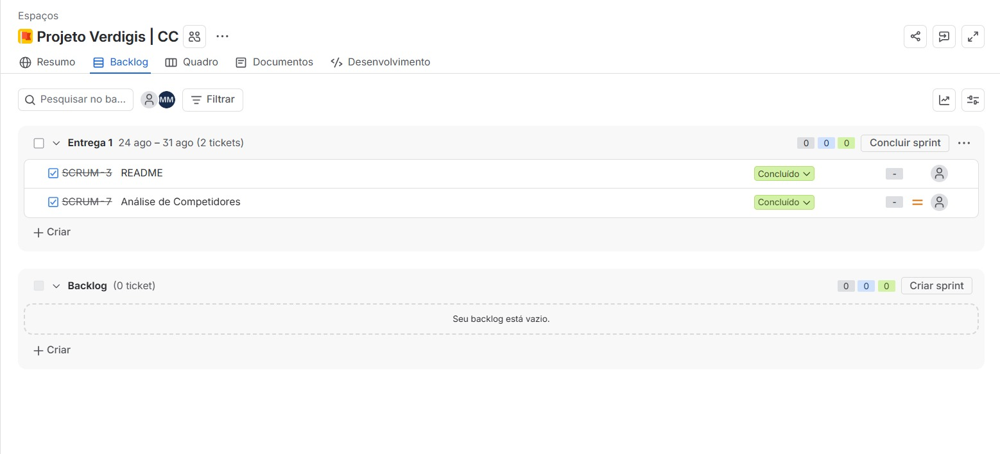
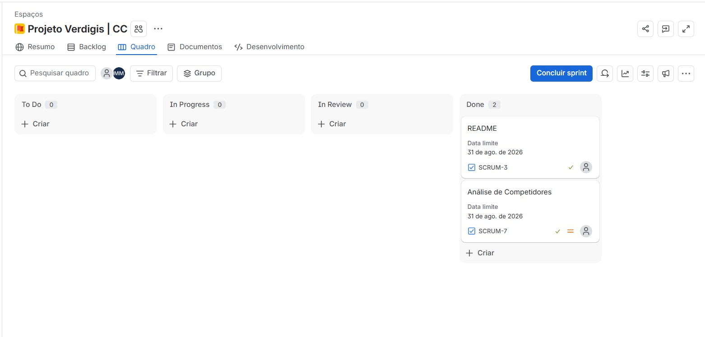

# 🌿 Projeto Verdigis

> **Desafio Proposto pela Deloitte:** Como aumentar a percepção de importância e impulsionar a aplicação de práticas ESG nas Pequenas e Médias Empresas (PMEs)?

---

## 📌 Visão Geral do Projeto

O **Projeto Verdigis** foi desenvolvido a partir de um desafio corporativo apresentado pela **Deloitte**. O objetivo principal é criar estratégias e soluções para ampliar a conscientização, desmistificar e acelerar a adoção das diretrizes **ESG** (*Environmental, Social, and Governance*) no ambiente das pequenas e médias empresas.

Embora o ESG tenha se tornado indispensável no mercado corporativo global, grande parte das PMEs ainda enxerga essas práticas como um custo inacessível ou algo exclusivo de grandes corporações. Este projeto busca mudar essa perspectiva, demonstrando o valor estratégico e financeiro da sustentabilidade corporativa.

---

## 📊 Contexto e Panorama do Mercado

As PMEs representam a espinha dorsal da economia, contudo enfrentam uma grande lacuna de informação e maturidade sobre ESG:

- 📈 **26,5% do PIB Nacional:** Impacto econômico direto gerado pelas micro, pequenas e médias empresas.
- 💼 **80% dos Empregos Gerados:** Maior força empregadora do mercado de trabalho.
- ❓ **67% sem Conhecimento Formal:** Não sabem o significado da sigla ESG, embora **já exerçam práticas sustentáveis e sociais em seu dia a dia** de forma intuitiva.

### Por que o ESG deixou de ser opcional?

A régua de decisão do mercado mudou radicalmente nos últimos anos:

1. **Investidores Globais:** Fundos de investimento utilizam rigorosos critérios ESG para alocação de aportes.
2. **Instituições Financeiras:** Bancos oferecem **linhas de crédito com condições e taxas de juros mais favoráveis** para empresas sustentáveis.
3. **Grandes Corporações:** Passaram a exigir conformidade ESG em toda a sua cadeia de **fornecedores e parceiros**.
4. **Consumidores:** Priorizam marcas transparentes, éticas e com responsabilidade ambiental e social.

---

## ⚠️ Dores, Barreiras e Riscos das PMEs

### Barreiras para a Adoção:
* **Custo Percebido:** Impressão de que ESG é apenas um custo extra sem retorno garantido.
* **Sobrevivência em 1º Lugar:** Foco total na gestão de caixa de curto prazo e emergências diárias.
* **Falta de Conhecimento e Complexidade:** Ausência de direcionamento prático sobre por onde começar.
* **Retorno "Invisível":** Dificuldade em mensurar o ROI (Retorno sobre Investimento) das ações socioambientais.
* **Ausência de Exigência Direta Percebida:** Acreditar que a cobrança recai apenas sobre multinacionais.

### Riscos da Não-Adoção (Consequências para o Negócio):
* 📉 **Contratos Perdidos:** Desqualificação em concorrências e perda de grandes clientes.
* 💸 **Crédito Mais Caro:** Dificuldade em obter financiamentos competitivos.
* ⚠️ **Reputação Exposta:** Vulnerabilidade a sanções e crises de imagem.
* 🚪 **Fuga de Talentos:** Perda de atratividade para novos profissionais e lideranças.

---

## 🎯 Objetivos do Projeto

- [x] **Traduzir e Desmistificar:** Converter os pilares ESG em linguagem simples e aplicável à realidade das PMEs.
- [x] **Mapear Práticas Intuitivas:** Ajudar empresários a reconhecer, mensurar e valorizar ações que já realizam no cotidiano.
- [x] **Evidenciar Retorno:** Demonstrar os ganhos em reputação, acesso a capital, eficiência operacional e novos contratos.

---

## 🛠️ Tecnologias e Ferramentas

*(Ajuste com a stack técnica exata do seu projeto)*

- **Linguagens / Análise de Dados:** HTML, CSS, Javascript, Python (Django), SQL
- **Ambiente de Desenvolvimento:** VS Code
- **Documentação:** Markdown / LaTeX

---
## Entrega 01:

* [Benchmark - Análise de Competidores](./docs/analisedecompetidores.md)

---

### BackLog

### Quadro do 1º Sprint

## Entrega 02:

## Entrega 03:

## Entrega 04:

## ✒️ Grupo e Créditos

### Integrantes:
| Nome | E-mail |
| :--- | :--- |
| Ana Luiza Carvalho Xavier | alcx@cesar.school |
| Carlos Henrique Corrêa de Araujo | chcass@cesar.school |
| Carlos Vinicius Encarnação do Nascimento | cven@cesar.school |
| João Pedro dos Santos Menezes | jpsm4@cesar.school |
| João Marcelo Franca da Costa Casado | jmfcc@cesar.school |
| Lucas de Moura Mattos | lmm7@cesar.school |
| Matheus Raulino de Souza Moreira | mrsm@cesar.school |
| Pétala Kiara da Silva | pks@cesar.school |
| Thácio Soares Miranda dos Santos | tsms2@cesar.school |
| Vitória de Assis Seabra | vas4@cesar.school |

### Parceiro do Desafio:
- **Deloitte**
